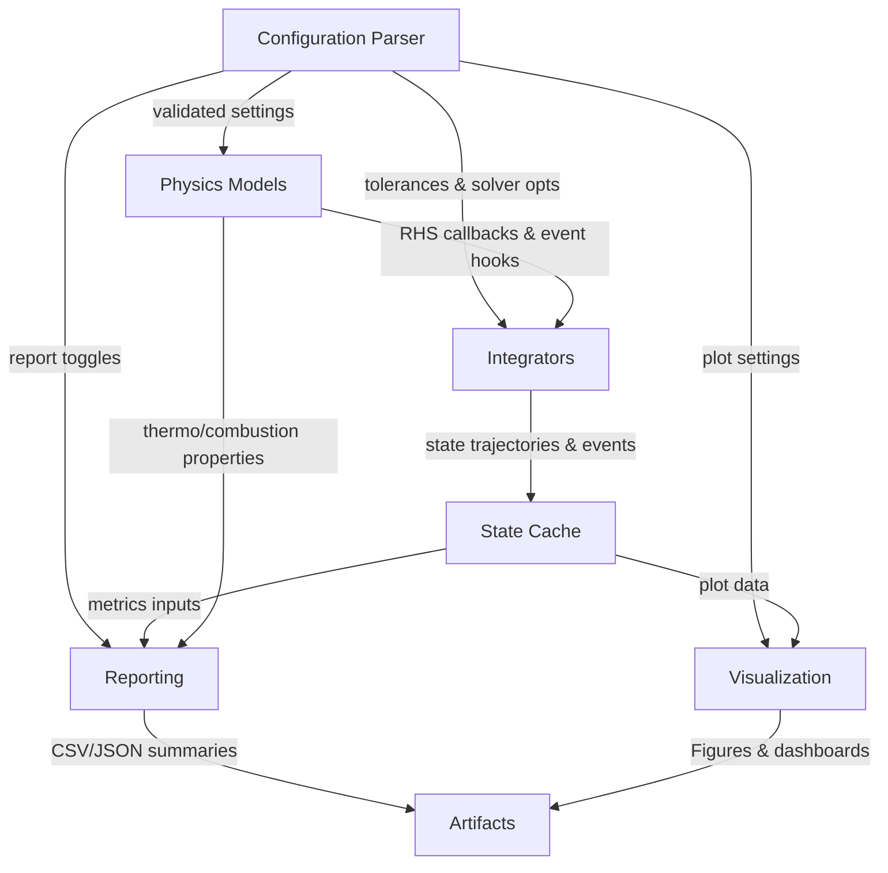

# Simulation Architecture Overview

This document outlines the packages for the simulation stack and the interfaces between physics models, integrators, configuration parsing, reporting, and visualization.

## High-level component diagram

## Package outline and interfaces

### `config`
- **Role:** Parse and validate YAML/TOML inputs into typed configuration objects.
- **Key interfaces:**
  - `SimulationConfig` (dataclass): engine geometry, operating point, solver tolerances, feature flags (reporting/plots).
  - `load_config(path) -> SimulationConfig`: loads, validates, and expands defaults.
- **Data flow:** Emits `SimulationConfig` consumed by `physics`, `integrators`, `reporting`, and `visualization` to control models, tolerances, and outputs.

### `physics`
- **Subpackages:**
  - `cycles`: Otto, Diesel, (extensible) combustion/heat-release models implementing `CycleModel` interface with `rhs(state, theta, params)` and event definitions.
  - `thermo`: property evaluation (ideal gas / tables) providing `ThermoState` updates and `gamma`, `cp`, `cv` helpers.
  - `losses`: friction, heat-transfer, and pumping loss models.
- **Interfaces:**
  - `CycleModel` exposes `rhs`, `events`, and `initial_state(config)` for integrators.
  - Models use `SimulationConfig` slices (geometry, fuel, boundary conditions).
- **Data flow:** Supplies RHS functions and event hooks to `integrators`; shares property evaluators to `reporting` for efficiency calculations.

### `integrators`
- **Role:** Advance cylinder/cycle state over crank angle.
- **Components:**
  - Adaptive Runge–Kutta driver with error control and min/max step clamping.
  - Fixed-step driver for deterministic regression.
  - Event manager to trigger valve timing, combustion start/stop, and volume-change discontinuities.
- **Interfaces:**
  - `Integrator` protocol with `step(model: CycleModel, state, theta, config) -> StepResult`.
  - Emits `StateSample` sequences and `EventRecord`s into `StateCache`.
- **Data flow:** Consumes `CycleModel` RHS/events from `physics` and solver tolerances from `config`; produces trajectories for `reporting` and `visualization`.

### `reporting`
- **Role:** Convert raw state traces into metrics and serialized artifacts.
- **Outputs:** IMEP/BMEP, power/torque, efficiency, fuel flow, cycle diagnostics, exported CSV/JSON summaries.
- **Interfaces:**
  - `ReportBuilder` consuming `StateCache`, `SimulationConfig`, and `Thermo` helpers.
  - `render_reports(cache, config) -> ReportBundle` with tabular data and file writers.
- **Data flow:** Pulls trajectories from `StateCache` and property helpers from `physics.thermo`; writes artifacts for downstream consumption.

### `visualization`
- **Role:** Generate plots and dashboards for diagnostics.
- **Artifacts:** P–V curves, P–θ traces, efficiency/IMEP summaries, optional comparison overlays.
- **Interfaces:**
  - `Plotter` consuming `StateCache`, `ReportBundle`, and visualization preferences from `SimulationConfig`.
  - `render_figures(cache, reports, config) -> list[Figure]` where figures can be saved or composed into dashboards.
- **Data flow:** Uses state trajectories and derived metrics to assemble figures, emitting image/PDF artifacts via configured writers.

### `state`
- **Role:** Central cache for simulation outputs.
- **Interfaces:**
  - `StateCache` storing ordered `StateSample` points and `EventRecord`s.
  - Provides iterators and down-sampling helpers for reporting/viz.
- **Data flow:** Populated by `integrators`; read by `reporting` and `visualization`.

## End-to-end flow
1. `config.load_config` produces `SimulationConfig` with geometry, operating point, tolerances, and requested outputs.
2. `physics` constructs a `CycleModel` and auxiliary property/loss models from the config.
3. `integrators` integrate the model over crank angle, pushing samples/events into `StateCache`.
4. `reporting` consumes `StateCache` and `SimulationConfig` (plus `physics` helpers) to compute metrics and write CSV/JSON artifacts.
5. `visualization` builds figures from `StateCache` and `ReportBundle`, saving plots to the artifact directory.

## Notes on extensibility
- New cycles plug in by implementing the `CycleModel` interface; integrators remain unchanged.
- Additional plots or reports register new builders that consume `StateCache` and `ReportBundle` without modifying core simulation logic.
- Config schema is versioned; backward compatibility handled inside `config` parser adapters.
